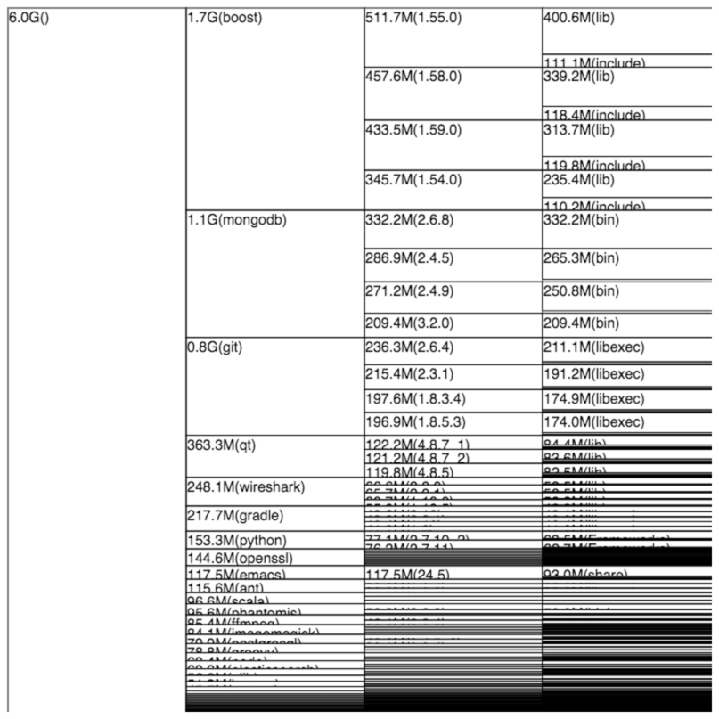

# Htmldu

`htmldu` visualizes your hierarchical disk usage with WebBrowser.

In other word, it's HTML-fied `xdu`.

## Installation

Add this line to your application's Gemfile:

```
$ gem install htmldu
```

## Usage

```
$ htmldu /usr/local/Cellar
```
will open browser and show directory hierarchy:



## Contributing

Bug reports and pull requests are welcome on GitHub at https://github.com/dagezi/htmldu.


## License

The gem is available as open source under the terms of the [MIT License](http://opensource.org/licenses/MIT).

